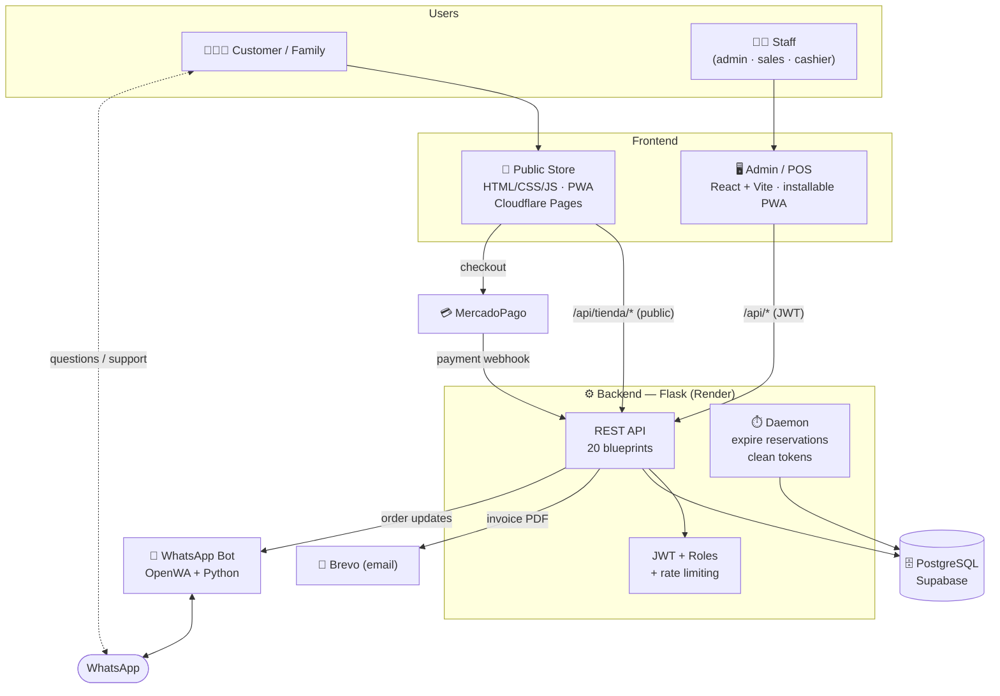
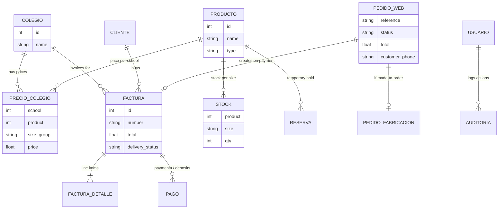
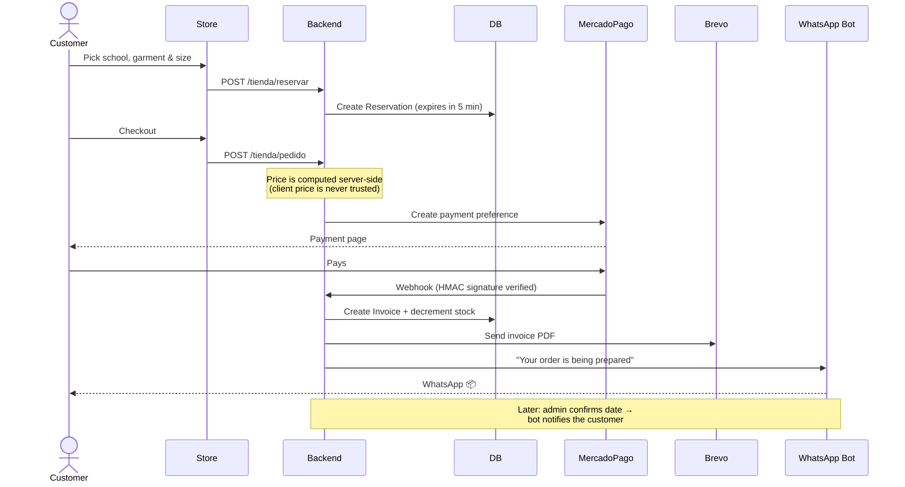
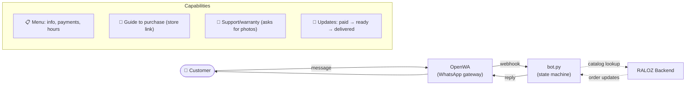
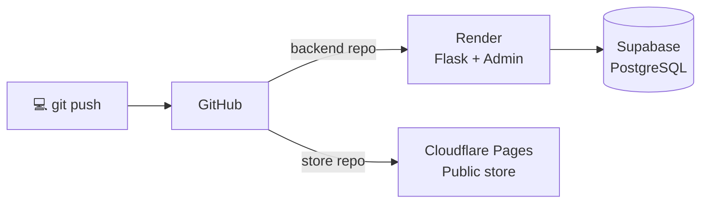

# RALOZ COL S.A.S — System Architecture

> Full-stack e-commerce platform for school uniforms: public storefront,
> admin/POS dashboard, payment gateway, e-invoicing, email notifications and a
> WhatsApp bot.

🇪🇸 *Versión en español: [ARQUITECTURA.md](ARQUITECTURA.md)*

---

## 📊 At a glance

| Metric | Value |
|---|---|
| Lines of code | **~23,000** |
| Backend (Flask) | 8,000 LOC · 20 API modules · 25 models |
| Admin panel (React) | 9,200 LOC · 19 UI domains |
| Public store (Vanilla JS) | 6,000 LOC · offline-capable PWA |
| Integrations | MercadoPago · Brevo · Google OAuth · WhatsApp |
| Deployment | Render · Cloudflare Pages · Supabase |

**Roles:** admin · salesperson · cashier · customer (public)

---

## 🎯 What it is

An end-to-end system for a real school-uniform manufacturing and retail business
in Bogotá, Colombia. It covers the full lifecycle: **catalog → online purchase →
payment → invoicing → inventory → made-to-order production → delivery → support**.

It is made of **three applications** sharing a single backend:

1. **Public store** — where customers buy (static, ultra-fast site).
2. **Admin / POS panel** — where staff run the business (React SPA).
3. **Backend** — the brain: REST API, business logic, integrations.

---

## 🏗️ High-level architecture



---

## 🧰 Tech stack

| Layer | Technology | Why |
|---|---|---|
| **Public store** | HTML5, CSS3, JavaScript (ES Modules), Service Worker | Zero build, instant load, works offline |
| **Admin panel** | React 18, Vite, React Router, Axios | Fast SPA with role-based protected routes |
| **Backend** | Python, Flask, SQLAlchemy | Modular REST API (one blueprint per domain) |
| **Auth** | Flask-JWT-Extended, bcrypt, Google OAuth | JWT + roles + blocklist (real logout) |
| **Database** | PostgreSQL (Supabase) | Relational, SSL, managed |
| **Payments** | MercadoPago (preferences + HMAC-signed webhooks) | Standard in Colombia |
| **Email** | Brevo API + ReportLab (in-memory PDF) | Invoice PDFs without writing to disk |
| **Security** | Flask-Limiter, CORS, headers (HSTS, CSP), bleach | Defense in depth |
| **WhatsApp bot** | OpenWA (gateway) + Flask (webhooks) | Auto-responder + automatic notifications |
| **Infra** | Render, Cloudflare Pages, Docker Compose | Free/scalable deployment |

---

## 🗃️ Data model (core entities)



> 💡 **Design detail:** prices are stored per **size group** (`6-8`, `S-M`) and
> expanded to individual sizes at query time, while stock is tracked per
> **individual size**. The conversion lives in `utils/tallas.py`.

---

## 🔄 Core flow: online purchase



**Resilience:** a daemon thread releases expired reservations every 60 s, so
abandoned carts never lock up stock.

---

## 🤖 WhatsApp bot



The bot handles **per-user stateful** conversations (menu → support → warranty),
requests photos for warranty claims and notifies an agent. It reuses the web
store for checkout instead of duplicating it.

---

## 🧩 Backend — module map (20 blueprints)

| Domain | Modules |
|---|---|
| **Sales & payments** | `facturas` · `pagos` · `ventas` · `caja` · `gastos` |
| **Inventory** | `stock` · `productos` · `precios` · `colegios` |
| **Production** | `pendientes` · `prendas_pendientes` · `empaque` |
| **Online store** | `tienda` (catalog, reservations, orders, MP webhook, ~1,300 LOC) |
| **Management** | `clientes` · `usuarios` · `tareas` · `dashboard` · `reportes` |
| **Platform** | `auth` (JWT, OAuth, logout) · `metodos_pago` |

Pattern: **one blueprint per domain**, SQLAlchemy models, authorization
decorators (`@rol_requerido`, `@admin_requerido`) and shared utilities
(`tallas`, `email_service`, `validators`, `decorators`, `whatsapp_notify`).

---

## 🔐 Security

A full security audit was performed and remediated (Jun 2026):

- ✅ **Authentication:** JWT (2 h access, 30 d refresh), bcrypt, account lockout
  after 5 attempts, **real logout** with a token blocklist.
- ✅ **Authorization:** role-gated routes; financial data is admin-only.
- ✅ **Payments:** server-side price computation; **HMAC-signed** MercadoPago
  webhook; idempotent against retries.
- ✅ **Hardening:** rate limiting, restricted CORS, security headers
  (HSTS, X-Frame-Options, CSP), SRI on CDNs, output sanitization (anti-XSS) and
  parameterized SQL (anti-injection).
- ✅ **Data:** secrets only in environment variables; automated database backups.

---

## 🚀 Deployment



| Component | Platform | Notes |
|---|---|---|
| Backend + Admin panel | Render | Gunicorn; SQL migrations on startup |
| Public store | Cloudflare Pages | No build; version-based cache busting |
| Database | Supabase (PostgreSQL) | SSL required |
| Payments | MercadoPago | Production + sandbox |
| Email | Brevo API | In-memory PDFs (Render has ephemeral disk) |

---

## 💻 Local development

```bash
# Backend
cd backend && python -m venv venv && venv/Scripts/activate
pip install -r requirements.txt && python run.py        # localhost:5000

# Admin panel
cd frontend && npm install && npm run dev               # localhost:5173

# Public store (no build)
cd Raloz && python serve.py                             # localhost:8080

# Database backup
cd backend && python backup_db.py
```

---

## ✨ Notable engineering decisions

- **Offline-first store:** Service Worker + static fallback catalog; if the
  backend is cold (Render free-tier ~90 s cold start), the store still works.
- **Server-authoritative pricing:** the client never sets the charged price (it
  is recomputed from the database).
- **In-memory PDF invoices:** generated with ReportLab without touching disk
  (compatible with Render's ephemeral filesystem).
- **Size groups vs. individual sizes:** price per group, stock per size.
- **Stock resilience:** reservations with automatic expiry via a daemon thread.
- **Decoupled notifications:** the backend calls the bot over HTTP with a shared
  token; if the bot is down, the business flow doesn't break (best-effort).
- **Installable admin PWA:** the React panel installs to a phone's home screen
  (manifest + service worker in `frontend/public/`); the SW never caches `/api/*`
  (JWT/live data), registers only in production, and auto-reloads on new versions.
- **80mm thermal POS ticket:** `Facturacion.jsx › imprimirRecibo()` prints a
  client-side receipt (company data, items, totals, warranty terms) to a SAT Q22;
  from a phone it prints via the RawBT Android app over Bluetooth.
```
