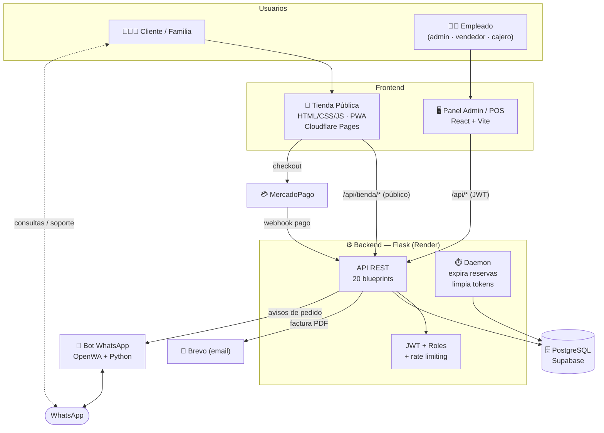
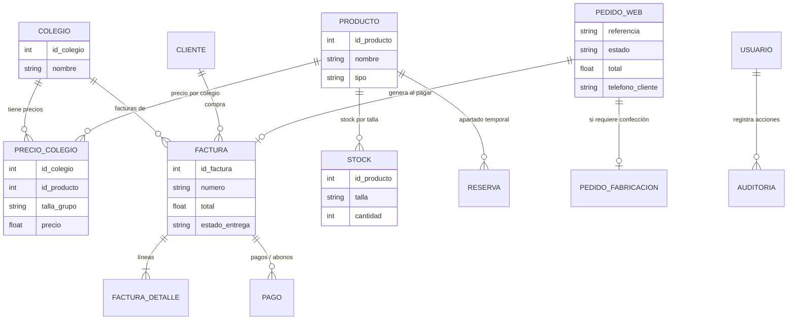
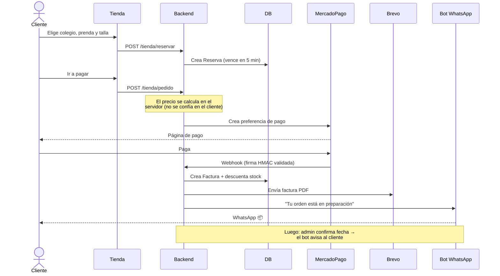
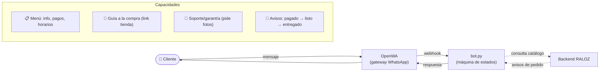
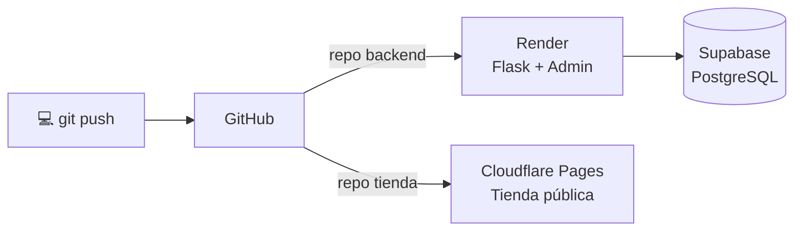

# RALOZ COL S.A.S — Arquitectura del Sistema

> Plataforma full-stack de comercio electrónico para uniformes escolares: tienda
> pública, panel administrativo/POS, pasarela de pagos, facturación electrónica,
> notificaciones por correo y bot de WhatsApp.

🇬🇧 *English version: [ARCHITECTURE.md](ARCHITECTURE.md)*

---

## 📊 De un vistazo

| Métrica | Valor |
|---|---|
| Líneas de código | **~23.000** |
| Backend (Flask) | 8.000 LOC · 20 módulos de API · 25 modelos |
| Panel admin (React) | 9.200 LOC · 19 dominios de UI |
| Tienda pública (Vanilla JS) | 6.000 LOC · PWA con offline |
| Integraciones | MercadoPago · Brevo · Google OAuth · WhatsApp |
| Despliegue | Render · Cloudflare Pages · Supabase |

**Roles:** administrador · vendedor · cajero · cliente (público)

---

## 🎯 Qué es

Sistema integral para un negocio real de confección y venta de uniformes
escolares en Bogotá. Cubre todo el ciclo: **catálogo → compra online → pago →
facturación → inventario → fabricación bajo pedido → entrega → soporte**.

Está compuesto por **tres aplicaciones** que comparten un único backend:

1. **Tienda pública** — donde el cliente compra (sitio estático, ultra-rápido).
2. **Panel Admin / POS** — donde el equipo gestiona el negocio (SPA React).
3. **Backend** — el cerebro: API REST, lógica de negocio, integraciones.

---

## 🏗️ Arquitectura general



---

## 🧰 Stack tecnológico

| Capa | Tecnología | Por qué |
|---|---|---|
| **Tienda pública** | HTML5, CSS3, JavaScript (ES Modules), Service Worker | Cero build, carga instantánea, funciona offline |
| **Panel admin** | React 18, Vite, React Router, Axios | SPA rápida con rutas protegidas por rol |
| **Backend** | Python, Flask, SQLAlchemy | API REST modular (1 blueprint por dominio) |
| **Auth** | Flask-JWT-Extended, bcrypt, Google OAuth | Tokens JWT + roles + lista negra (logout real) |
| **Base de datos** | PostgreSQL (Supabase) | Relacional, SSL, gestionado |
| **Pagos** | MercadoPago (preferencias + webhooks con firma HMAC) | Estándar en Colombia |
| **Email** | Brevo API + ReportLab (PDF en memoria) | Facturas PDF sin escribir a disco |
| **Seguridad** | Flask-Limiter, CORS, headers (HSTS, CSP), bleach | Defensa en profundidad |
| **Bot WhatsApp** | OpenWA (gateway) + Flask (webhooks) | Contestador + avisos automáticos |
| **Infra** | Render, Cloudflare Pages, Docker Compose | Despliegue gratis/escalable |

---

## 🗃️ Modelo de datos (entidades principales)



> 💡 **Detalle de diseño:** los precios se guardan por **grupo de talla**
> (`6-8`, `S-M`) y se expanden a tallas individuales en tiempo de consulta,
> mientras que el stock se controla por **talla individual**. La conversión vive
> en `utils/tallas.py`.

---

## 🔄 Flujo estrella: compra online



**Resiliencia:** un hilo daemon libera cada 60 s las reservas vencidas, evitando
que el stock quede bloqueado por carritos abandonados.

---

## 🤖 Bot de WhatsApp



El bot maneja conversaciones con **estado por usuario** (menú → soporte →
garantía), pide fotos para garantías y notifica al asesor. Reutiliza la tienda
web para la compra en vez de duplicarla.

---

## 🧩 Backend — mapa de módulos (20 blueprints)

| Dominio | Módulos |
|---|---|
| **Ventas y pagos** | `facturas` · `pagos` · `ventas` · `caja` · `gastos` |
| **Inventario** | `stock` · `productos` · `precios` · `colegios` |
| **Producción** | `pendientes` · `prendas_pendientes` · `empaque` |
| **Tienda online** | `tienda` (catálogo, reservas, pedidos, webhook MP, ~1.300 LOC) |
| **Gestión** | `clientes` · `usuarios` · `tareas` · `dashboard` · `reportes` |
| **Plataforma** | `auth` (JWT, OAuth, logout) · `metodos_pago` |

Patrón: **1 blueprint por dominio**, modelos SQLAlchemy, decoradores de
autorización (`@rol_requerido`, `@admin_requerido`) y utilidades compartidas
(`tallas`, `email_service`, `validators`, `decorators`, `whatsapp_notify`).

---

## 🔐 Seguridad

Auditoría de seguridad realizada y corregida (jun 2026):

- ✅ **Autenticación:** JWT (acceso 2 h, refresco 30 d), bcrypt, bloqueo de
  cuenta tras 5 intentos, **logout real** con lista negra de tokens.
- ✅ **Autorización:** rutas por rol; datos financieros solo para administrador.
- ✅ **Pagos:** precio calculado en servidor; webhook de MercadoPago con
  **firma HMAC**; idempotencia ante reintentos.
- ✅ **Hardening:** rate limiting, CORS restringido, headers de seguridad
  (HSTS, X-Frame-Options, CSP), SRI en CDNs, sanitización (anti-XSS) y
  parametrización SQL (anti-inyección).
- ✅ **Datos:** secretos solo en variables de entorno; respaldos automáticos
  de la base de datos.

---

## 🚀 Despliegue



| Componente | Plataforma | Notas |
|---|---|---|
| Backend + Panel admin | Render | Gunicorn; migraciones SQL en el arranque |
| Tienda pública | Cloudflare Pages | Sin build; cache-busting por versión |
| Base de datos | Supabase (PostgreSQL) | SSL obligatorio |
| Pagos | MercadoPago | Producción + sandbox |
| Email | Brevo API | PDFs en memoria (Render no persiste disco) |

---

## 💻 Desarrollo local

```bash
# Backend
cd backend && python -m venv venv && venv/Scripts/activate
pip install -r requirements.txt && python run.py        # localhost:5000

# Panel admin
cd frontend && npm install && npm run dev               # localhost:5173

# Tienda pública (sin build)
cd Raloz && python serve.py                             # localhost:8080

# Respaldo de la base de datos
cd backend && python backup_db.py
```

---

## ✨ Decisiones de ingeniería destacadas

- **Tienda offline-first:** Service Worker + catálogo estático de respaldo; si el
  backend está caído (cold start de Render ~90 s), la tienda sigue funcionando.
- **Precio autoritativo en servidor:** el cliente nunca define el precio que se
  cobra (se recalcula desde la base de datos).
- **Facturas PDF en memoria:** generadas con ReportLab sin tocar disco
  (compatible con el filesystem efímero de Render).
- **Grupos de talla vs. tallas individuales:** precio por grupo, stock por talla.
- **Resiliencia de stock:** reservas con expiración automática vía hilo daemon.
- **Notificaciones desacopladas:** el backend avisa al bot por HTTP con token
  compartido; si el bot no está, el flujo de negocio no se rompe (best-effort).
